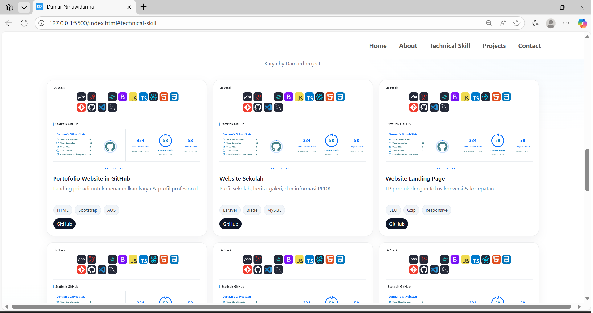

# Portofolio-DamarNinuwidarma-PBP 23-10-2025

Proyek ini adalah halaman portfolio sederhana dengan menerapkan html/cs/js.  
Struktur terdiri dari tiga halaman utama:

- `index.html` – Landing/Portfolio (Home, About, Technical Skill, Projects, Contact)
- `index2.html` – Statistik Keaktifan (grafik/laporan singkat aktivitas & bahasa yang sering dipakai)
- `index3.html` – Profil • Kerjasama • Kontak (company/profile style dengan call-to-action)

---

## 🖼️ Tangkapan Layar

### 1) Home / Landing (index.html)
**Desktop**

**Tablet**

**Mobile**

**Penjelasan**  
- **Desktop**: Hero 2 kolom (teks kiri, foto kanan), spacing lapang, tombol CTA jelas.  
- **Tablet**: Grid menyusut jadi 2 kolom; padding & font-size menyesuaikan.  
- **Mobile**: Satu kolom penuh untuk keterbacaan; tombol besar dan mudah di-tap.

---

### 2) Tech Stack & Projects (index.html – bagian tengah)

**About**

**Tech Stack**

**Projects** (example)

**Penjelasan**  

Tampilan Tampilan Tersebut merupakan hasil gambar dari bagaian web ketika di scroll
---

### 3) Statistik Keaktifan (index2.html)

**Penjelasan**  
- Ringkasan kontribusi, streak

---

### 4) Profil • Kerjasama • Kontak (index3.html)

**Penjelasan**  
- Halaman profil ringkas: nilai utama, keahlian, komitmen. Ada CTA **Ajukan Kerjasama** & **Hubungi Kami**.

---

## 🔗 Tautan Penting

- **Halaman utama**: `index.html`  
- **Statistik**: `index2.html`  
- **Profil/Kerjasama**: `index3.html`

---

## 📹 Demo Video

Tonton demo lengkap di YouTube: **comming soon**

